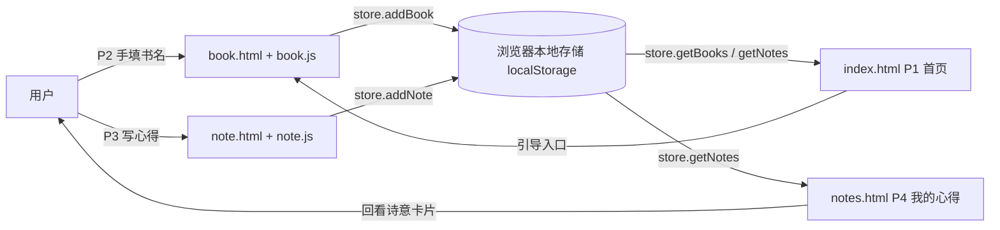

# TECH_DESIGN.md — 栀书心驿（ZhiShu XinYi）技术设计

> 项目类型：课程实战 · Day 5 技术选型（TECH_DESIGN）
> 依据文档：`PRD.md`（同目录，已入库）
> 版本：v0.1（MVP 阶段） ｜ 最后更新：Day 5
> 关联：本文件不含代码，只定义"怎么搭、用什么、数据怎么走"。

---

## 0. 先讲清楚：技术选型在选什么（前后端 / 数据库分工）
PRD 回答了"做什么"，技术选型回答"用什么做、谁负责哪一块"。一个网页产品通常分三层：

| 层 | 职责 | 在栀书心驿里管什么 |
|----|------|--------------------|
| **前端（Frontend）** | 用户看得到、点得到的界面与交互 | 诗意首页 P1、书籍录入 P2、心得书写 P3、我的心得 P4；收集用户输入、渲染展示 |
| **后端（Backend）** | 看不见的"服务器逻辑"：校验、计算、接口 | MVP **暂无后端**（见 §1 路线）；未来若上云，负责接收数据、鉴权、转发 |
| **数据库（Database）** | 长期存放数据的"仓库" | MVP 用**浏览器本地存储**代替；未来若上云，用云端数据库 |

> 关键认知：MVP 阶段我们**把"后端 + 数据库"合并进浏览器本地**，所以不需要服务器、不需要账号、不花一分钱——这是为"学习成本最低、最快看到成品"做的取舍。

---

## 1. 技术路线（一句话）
> **技术路线（MVP）：纯静态前端（HTML + CSS + 原生 JavaScript） + 浏览器本地存储（localStorage / IndexedDB），无后端、无数据库服务器，部署到 GitHub Pages（免费）。**
> ⚠️ 已定：MVP 本地优先；**MVP 后迁移上云（方案 B）**，触发条件与步骤见 §6.3 与 §9。当前按本地优先落地。

---

## 2. 方案 A / B 比较与推荐
> 下面按任务要求的四个维度（学习成本、线上持久化、费用、排错难度）对比两套路线，并给出推荐。

| 维度 | 方案 A：纯前端 + 本地存储（**MVP 采用**） | 方案 B：前端 + 后端 + 云数据库 |
|------|------------------------------------------|-------------------------------|
| **组成** | HTML/CSS/JS + localStorage/IndexedDB | 前端 + Node/接口 + Supabase/SQLite 等云库 |
| **学习成本** | 低。只需学 HTML/CSS/JS 与浏览器存储 API，零后端概念 | 高。要学后端语言、API、数据库、鉴权、部署服务器 |
| **线上持久化** | 弱。数据存在**本机浏览器**，换设备/清缓存即丢失，非"云端同步" | 强。数据存云端，任意设备登录可读写，真·多端同步 |
| **费用** | 0 元（GitHub Pages 免费托管静态站） | 低~中。免费额度够用，超量按量计费；需绑定支付方式 |
| **排错难度** | 低。问题基本在前端，浏览器 F12 控制台即可看；无网络/服务器变量 | 高。链路长（前端→网络→后端→数据库），任一段出错都要查 |
| **账号限制** | 无需任何云账号，只要 GitHub 即可托管 | 需注册云服务商账号（如 Supabase），有账号/实名门槛 |

### 推荐结论与原因
- **MVP 推荐方案 A（本地优先）。** 理由：
  1. 符合 PRD 第 4 节既定边界——"复杂账号 / 多端同步暂缓，MVP 可用本地存储起步"；
  2. 对课程学习与限时交付最友好：学习成本与排错难度最低、零费用、零额外账号；
  3. 能完整验证核心假设——"大众愿不愿意静心读一点、写一点"，不需要先啃后端；
  4. 数据是本产品的灵魂，但 MVP 阶段先"能写能存能回看"比"能云同步"更关键。
- **方案 B 作为明确迁移路径**（见 §6.3、§9），待"书写习惯成立、需要多设备"时再上，不在 MVP 浪费复杂度。

---

## 3. 项目结构（对应 PRD 的页面与功能）
> 结构刻意贴近 PRD 的 P1–P4 与 F1–F3，做到"看到文件夹就能想起页面"。

```
zhishu-xinyi/
├─ index.html          # P1 诗意首页（F1）：当日寄语、入口按钮
├─ book.html           # P2 书籍录入 / 书籍空间页（F2）：手动输入书名
├─ note.html           # P3 心得书写页（F3）：书写文本框 + 心情标签
├─ notes.html          # P4 我的心得列表页：按书名/日期回看
├─ css/
│  └─ style.css        # 诗意氛围样式：柔色、留白、衬线字体、舒缓动效
├─ js/
│  ├─ home.js          # P1 逻辑：寄语生成、入口跳转
│  ├─ book.js          # P2 逻辑：书名输入校验、写入 book
│  ├─ note.js          # P3 逻辑：心得提交、写入 note（含 mood）
│  ├─ notes.js         # P4 逻辑：读取 note 列表渲染
│  └─ store.js         # 本地存储封装：book/note 的增删查（替代后端 API）
├─ assets/             # 自然意象素材（栀子/书页/微光，SVG 或轻量图）
├─ PRD.md              # 产品需求（Day 4 产出）
├─ research.md         # 研究依据（Day 4 产出）
└─ TECH_DESIGN.md      # 本文件（Day 5 产出）
```
**对照自检**：P1→`index.html`、P2→`book.html`、P3→`note.html`、P4→`notes.html`；F1→`home.js`、F2→`book.js`、F3→`note.js`，结构一一对应，无悬空功能。

---

## 4. 数据对象及字段（沿用 PRD §3.1）
| 对象 | 字段 | 类型 | 说明 |
|------|------|------|------|
| **book（书籍）** | `id` | string | 唯一 ID（本地用时间戳/uuid 生成） |
| | `title` | string | 书名，用户手填 |
| | `user_id` | string | 归属用户（MVP 本地单用户，可固定为 `local`） |
| | `created_at` | string | 录入时间（ISO 时间） |
| **note（心得）** | `id` | string | 唯一 ID |
| | `book_id` | string | 归属书籍（关联 book.id） |
| | `content` | string | 心得正文 |
| | `mood` | string? | 可选心情标签；取值见 §4.1 枚举（可空） |
| | `user_id` | string | 归属用户 |
| | `created_at` | string | 书写时间 |
| **user（用户）** | `id` | string | 唯一 ID（MVP 默认 `local`） |
| | `nickname` | string? | 可选昵称 |
| | `created_at` | string | 创建时间 |

> MVP 为单用户本地场景，`user_id` 默认固定值即可；上云后改为真实登录用户。

### 4.1 心情标签（mood）枚举 · 已定
> MVP 录入心得时可选一个心情标签，用于诗意卡片上的情绪点缀，以及日后回看时的情绪线索。取值为固定枚举（存储为 `string`，展示用原值；上云后可落为 lookup 表或 CHECK 约束）。**可空**——用户不点也算合法。

| 取值 | 含义 |
|------|------|
| `平静` | 读后心静、无波 |
| `温暖` | 被文字焐热、安心 |
| `触动` | 被某句话击中、有共鸣 |
| `治愈` | 读完觉得被抚平、被接住 |
| `思索` | 引发回味与省思 |
| `困惑` | 有疑问、没想通 |
| `轻盈` | 读后松快、如释 |
| `惆怅` | 淡淡怅然、余味 |

> 扩展规则：上代码前如需增减取值，只改本表与 `js/note.js` 的标签源、`css/style.css` 的色点样式，不动存储结构（`mood` 仍是自由 string）。

---

## 5. API 列表（MVP 用本地存储函数替代后端接口）
> 本地优先下没有网络 API，由 `js/store.js` 提供等价函数；括号内标注"未来云版对应的 REST 接口"，方便迁移。

| 功能 | 本地函数（MVP） | 未来云版 REST（迁移用） | 读写对象 |
|------|----------------|--------------------------|----------|
| 录入书名 | `store.addBook(title)` | `POST /api/books` | book（写） |
| 读取书籍列表 | `store.getBooks()` | `GET /api/books` | book（读） |
| 写心得 | `store.addNote(bookId, content, mood)` | `POST /api/notes` | note（写） |
| 读取某书心得 | `store.getNotesByBook(bookId)` | `GET /api/books/:id/notes` | note（读） |
| 读取全部心得 | `store.getNotes()` | `GET /api/notes` | note（读） |
| 删除心得（可选） | `store.removeNote(id)` | `DELETE /api/notes/:id` | note（删） |

**每个 MVP 动作的落点**：
- F2 输入书名 → `store.addBook()` 写 book → P2 展示该书卡片；
- F3 写心得 → `store.addNote(bookId, content, mood)` 写 note（`mood` 取 §4.1 枚举之一或空）→ P4 列表读取展示；
- P1 首页 → `store.getBooks()` 轻量读取以判断是否已有记录。

---

## 6. 数据流（文字 + 图）
### 6.1 一句话（每日一问答案）
> **数据从哪来、到哪去**：数据来自用户在 P2/P3 页面手填的书名与心得，**经前端 JS 存入浏览器本地存储（localStorage）**，再**被 P1/P4 页面读取出来，以诗意卡片的形式展示回看**——全程不离开用户自己的浏览器。

### 6.2 数据流图（Mermaid）

> 图中实线即"从哪来→到哪去"：用户 → 页面/JS → 本地存储 → 读取展示。换设备/清缓存时本地存储清空，这正是 §2 方案 B 要解决的"线上持久化"短板。

### 6.3 云端数据流（方案 B，MVP 后迁移启用）· 已定路线
> MVP 阶段数据留在本地（见 §6.1/§6.2）；一旦验证"书写习惯成立 + 需要多设备"，即切换到下方云端数据流。届时 §5 的本地函数整体替换为对应 REST 调用，数据流加长但获得跨设备持久化。

```
用户 → 前端(校验) → 后端 API(鉴权/校验) → 云数据库(持久化)
                                ↑                    │
                                └──── 读取时原路返回 ──┘
```

**迁移触发条件**（满足即启动）：
1. 真实使用数据显示用户有回看 / 多设备需求（而非假设）；
2. 本地存储"换设备 / 清缓存即丢"的短板开始影响留存。

**切换动作**（详见 §9）：新增后端 + 云数据库 → `user_id` 改真实登录 → 本地数据导入云库 → 密钥走环境变量。

---

## 7. 错误处理
| 场景 | 本地优先（MVP）处理 | 未来云版补充 |
|------|---------------------|--------------|
| 输入为空（书名/心得） | 前端校验拦截，提示"写点什么再保存吧" | 同左 + 后端二次校验 |
| 本地存储写入失败（隐私模式/配额满） | 捕获异常，提示"浏览器不允许保存，请关闭无痕模式或清理空间" | 失败回退云端 |
| 读取为空（无记录） | 展示空状态诗意文案"还没开始，今天就是第一天" | 同左 |
| 数据损坏/解析失败 | try-parse，失败则用空数据并提示 | 后端兜底备份 |

原则：前端做"温柔拦截"，不抛生硬报错；任何失败都给用户一句可懂的话，而非堆栈。

---

## 8. 环境变量
| 变量 | MVP（本地） | 未来云版 |
|------|-------------|----------|
| `API_BASE_URL` | 不需要（无后端） | 后端地址 |
| `SUPABASE_URL` / `SUPABASE_KEY` | 不需要 | 云数据库凭证 |
| `STORAGE_KEY` | 可选，本地存储命名空间前缀（如 `zhishu_`） | 同左 |

> MVP 阶段**无密钥类环境变量**，降低泄露风险；上云后密钥一律走环境变量，不写进代码。

---

## 9. 部署和迁移注意事项
- **部署（MVP）**：静态文件直接推到 GitHub，仓库开启 **GitHub Pages**（Settings → Pages → 选 `master` 分支根目录），即获得免费网址；无需服务器、无后端。
- **迁移到方案 B（云）· 已定路线**（触发条件见 §6.3）：
  1. **选型**：后端用 Node / 边缘函数，云数据库用 Supabase(Postgres) 或 SQLite + 云函数；二者均有免费额度，避免过早绑卡。
  2. **数据模型映射**：把本地 `book` / `note` / `user` 三对象落成数据表，字段沿用 §4（含 `mood` 枚举可作 CHECK 或 lookup 表）；`user_id` 由固定 `local` 改为真实登录用户主键。
  3. **接口替换**：`js/store.js` 的本地函数整体替换为 §5 右侧 REST 调用（接口映射已留），页面层（home/book/note/notes.js）基本不动，只改 store 实现。
  4. **数据迁移**：首次上云提供"本地 → 云"导入脚本，把 localStorage 旧数据按 `user_id` 归并后写入云库，避免用户丢失已写心得。
  5. **鉴权与密钥**：引入登录；`API_BASE_URL` / `SUPABASE_URL` / `SUPABASE_KEY` 等一律走环境变量（§8），禁止硬编码；前端只持最小可用 token。
  6. **过渡策略**：建议先"双写"（本地 + 云）灰度，确认云读写在多数设备稳定后再关闭本地写，降低迁移风险。
- **注意**：GitHub Pages 只托管静态内容，**不能跑后端**；上云需另选托管（如 Vercel / Netlify / 云函数 + Supabase）。MVP 阶段无需考虑这些。

---

## 10. 原待定项 · 现已全部决定
1. ~~**是否上云数据库**~~ **已决定：MVP 本地优先，MVP 后迁移上云（方案 B）**。触发条件见 §6.3，步骤见 §9；当前不推翻 MVP 本地设计。
2. ~~**前端是否用框架**~~ **已决定：用原生 JS（HTML/CSS/原生 JS，零构建、最简）**。触发切换：出现多视图路由 / 组件间共享状态变复杂 / 课程明确要求组件化时，再上 Vue/React（学习成本上升）。
3. ~~**心情标签（mood）取值**：暂未定义枚举~~ **已定**：枚举见 §4.1（平静/温暖/触动/治愈/思索/困惑/轻盈/惆怅），可空；录入与展示联动 `js/note.js`、`css/style.css`。
4. ~~**本地存储选型**~~ **已决定：用 localStorage（简单、同步、5MB 配额足够）**。触发切换：心得量级到几千条 / 需存图片音频 / 需本地索引查询时，再升 IndexedDB（异步、容量大）。

---

## 11. 余力加练：方案变化时哪些文件会受影响
| 若发生变更 | 受影响文件 | 说明 |
|------------|-----------|------|
| 上云数据库（方案 B，已定 MVP 后路线） | `js/store.js`、`js/book.js`、`js/note.js`、`js/notes.js`、新增后端、新增环境变量(.env) | store 函数整体改 REST 调用；详见 §6.3/§9 |
| 换前端框架（Vue/React） | 全部 `js/*.js`、`index.html` 等页面 | 需组件化重写，结构大改 |
| mood 枚举调整（增删取值） | `js/note.js`、`css/style.css`、（PRD 可选同步） | 录入标签源与色点样式联动，存储结构不变 |
| 新增 P5 页面（如书单） | 新增 `xxx.html`+`xxx.js`、`js/store.js` | 扩展读取逻辑 |
| 改视觉基调 | `css/style.css`、`assets/` | 全局氛围，影响所有页面 |

### 技术栈科普（开发网页 / App 会用到哪些技术）
- **HTML**：网页的"骨架"，定义有什么内容（标题、按钮、输入框）。
- **CSS**：网页的"皮肤"，决定长相与氛围（本项目的诗意留白、柔色、衬线字体都靠它）。
- **JavaScript（JS）**：网页的"大脑"，负责交互与逻辑（收集输入、存数据、渲染列表）。
- **前端框架（Vue/React）**：把 JS 组织成"组件"的工具，中大型项目更易维护，但要多学构建工具，小项目未必划算。
- **后端（Node/Python/Java 等）**：放在服务器上的程序，处理登录、计算、存数据；MVP 不需要。
- **数据库（MySQL/PostgreSQL/Supabase 等）**：长期存数据的仓库；云端才有，本地用浏览器存储代替。
- **托管/部署（GitHub Pages/Vercel/云服务器）**：把做好的网站放到网上让人访问的服务。
- **优劣势一句话**：原生三件套（HTML/CSS/JS）**学得快、零依赖、适合 MVP**；框架与后端**能力强但学习与维护成本高**，应在"真的需要"时才引入。

---

## 12. 每日一问：用一句话说清你的数据从哪来、到哪去
> 数据来自用户在网页上手填的书名与读书心得，**经前端存入浏览器本地存储**，再**被首页与"我的心得"页面读取，以诗意卡片回看**；MVP 阶段数据始终留在用户自己的浏览器里，不上传任何服务器。
