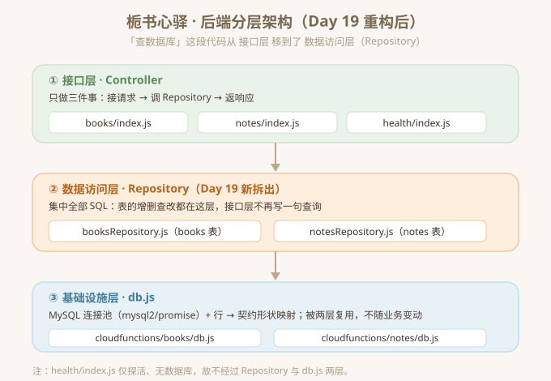

# 栀书心驿 · 后端分层重构说明（Day 19）

> 目标：把「查数据库」这段代码从**接口层（index.js）** 平移到新拆出的**数据访问层（Repository）**，
> 接口层只保留「接请求 → 调函数 → 返响应」。所有接口行为、响应形状、SQL 与原先完全一致。

## 一、分层示意图



- **① 接口层（Controller）** —— `books/index.js`、`notes/index.js`、`health/index.js`
  职责：CORS、参数校验、错误码映射、调用 Repository、组装并返回契约响应。不再出现任何 SQL。
- **② 数据访问层（Repository，Day 19 新拆出）** —— `booksRepository.js`、`notesRepository.js`
  职责：集中 books 表 / notes 表的全部 `SELECT` / `INSERT`，返回「契约形状」的对象（复用 `db.js` 的映射函数）。
- **③ 基础设施层（Infrastructure）** —— `db.js`（两个云函数各一份）
  职责：`mysql2/promise` 连接池 + 行 → 契约形状的映射函数（`mapBookRow` / `mapNoteRow`）。被两层复用。

> `health/index.js` 仅探活、无数据库，不经过 Repository 与 db.js 两层。

## 二、重构后的目录结构

```
cloudfunctions/
├─ books/
│  ├─ booksRepository.js   ← 新 · Day 19：books 表全部 SQL 集中于此
│  ├─ db.js                ← 基础设施层：连接池 + 行→契约形状映射
│  ├─ index.js             ← 接口层：委托给 booksRepository
│  └─ package.json
├─ notes/
│  ├─ notesRepository.js   ← 新 · Day 19：notes 表全部 SQL 集中于此
│  ├─ db.js
│  ├─ index.js             ← 接口层：委托给 notesRepository
│  └─ package.json
└─ health/
   └─ index.js             ← 探活，无数据库，无需 Repository

db/            schema.sql · seed.sql
js/ css/ assets/   前端
根目录          PRD.md · research.md · TECH_DESIGN.md · AGENTS.md · api-contract.md
```

**本次「查数据库」代码的迁移落点：**
| 原位置（接口层） | 新位置（数据访问层） |
| --- | --- |
| `books/index.js` 内联的 `SELECT … FROM books` 与 `INSERT INTO books` | `cloudfunctions/books/booksRepository.js` |
| `notes/index.js` 内联的 `SELECT … FROM notes` | `cloudfunctions/notes/notesRepository.js` |

## 三、全接口回归验证清单

验证方式：用「内存数据库替身」真实执行重构后的云函数代码（`outputs/Day19/regression.cjs`），
断言状态码、响应 `ok`、字段形状、错误码，并**逐字比对执行的 SQL 与原 index.js 内联 SQL 一致**。结果：**51 / 51 全部通过**。

| 接口 | 方法 | 场景 | 预期 | 结果 |
| --- | --- | --- | --- | --- |
| `/api/health` | GET | 探活 | `200 {ok:true, service:"zhishu-xinyi"}` | ✅ |
| `/api/books` | GET | 列表（默认 limit=10） | `200`，按 `created_at` 倒序，5 本书 | ✅ |
| `/api/books` | GET | `limit=2` | 截断为 2 条 | ✅ |
| `/api/books` | GET | `limit=999` | 钳制为 100 | ✅ |
| `/api/books` | POST | 新增《夜莺与玫瑰》 | `201 {ok:true, book:{…}}`，`user_id=local` | ✅ |
| `/api/books` | POST | 缺 title | `400 {ok:false, error:"invalid_param"}` | ✅ |
| `/api/books` | POST | 重复收录《小王子》 | `409 {ok:false, error:"duplicate"}` | ✅ |
| `/api/books` | GET | 数据库异常 | `500 {ok:false, error:"server_error"}` | ✅ |
| `/api/notes` | GET | 列表（默认 limit=10） | `200`，6 条心得，含 `mood` 数组 | ✅ |
| `/api/notes` | GET | `limit=3` | 截断为 3 条 | ✅ |
| `/api/notes` | GET | `limit=999` | 钳制为 100 | ✅ |
| 全部接口 | — | 执行的 SQL 逐字比对 | 与重构前内联 SQL 完全一致 | ✅ |

> 响应形状（字段名、`user_id` 下划线风格、`created_at` ISO 字符串、数组顺序）与重构前零差异。

## 四、本次改动文件清单（按所属 Day 任务）

| 文件 | 操作 | 所属任务 |
| --- | --- | --- |
| `cloudfunctions/books/booksRepository.js` | 新增 | Day 19 |
| `cloudfunctions/notes/notesRepository.js` | 新增 | Day 19 |
| `cloudfunctions/books/index.js` | 改写（删内联 SQL，改调 repo） | Day 19 |
| `cloudfunctions/notes/index.js` | 改写（删内联 SQL，改调 repo） | Day 19 |
| `outputs/Day19/regression.cjs` · `make-proof.cjs` · `server.cjs` | 新增（验证脚本） | Day 19 |
| `outputs/Day19/proof.html` · `structure.html` · `分层示意图.svg` · `分层架构图.md` | 新增（交付物） | Day 19 |

> 契约（`api-contract.md`）路径与字段名未动；未新增任何功能。
